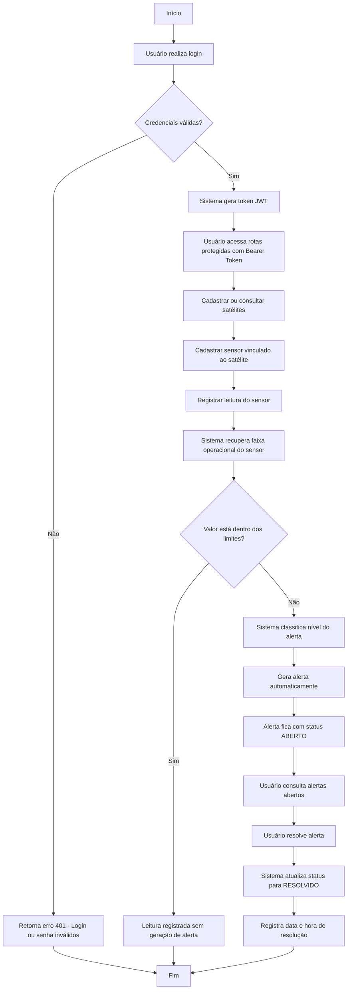

# SpaceGuard API — Global Solution 2026

API REST desenvolvida para a disciplina de **Arquitetura Orientada a Serviços (SOA) e Web Services**, no contexto da **Global Solution 2026 — Space Connect**.

O projeto simula uma central de monitoramento espacial capaz de gerenciar **usuários, satélites, sensores, leituras e alertas operacionais**. A proposta é representar uma solução de software voltada ao acompanhamento de ativos espaciais, onde sensores embarcados em satélites registram dados e o sistema identifica automaticamente leituras fora da faixa operacional, gerando alertas para análise e resolução.

---

## Contexto da solução

O tema da Global Solution 2026 propõe o uso de tecnologia, dados e inovação para resolver desafios relacionados à economia espacial e à aplicação de soluções espaciais em problemas reais.

A **SpaceGuard API** foi pensada como uma solução para monitoramento de satélites e sensores em ambientes críticos. Em operações espaciais, falhas relacionadas à temperatura, energia, comunicação ou radiação podem comprometer missões inteiras. Por isso, a API registra leituras históricas, avalia limites operacionais e gera alertas automáticos quando um valor crítico é identificado.

---

## Objetivo do projeto

O objetivo principal é construir uma API REST com boas práticas de arquitetura, segurança e persistência, aplicando conceitos de:

- Arquitetura Orientada a Serviços;
- Web Services REST;
- Programação Orientada a Objetos;
- Autenticação e autorização;
- Banco de dados relacional;
- Documentação automática;
- Testes funcionais;
- Evidências de execução.

---

## Integrantes

| Nome | RM |
|---|---|
| MATHEUS FARIAS DE LIMA | RM554254 |
| MIGUEL MAURICIO PARRADO PATARROYO | RM554007 |
| VITOR PINHEIRO NASCIMENTO | RM553693 |
| GABRIEL LEÃO | RM552642 |
| PEDRO HENRIQUE NARDACI CHAVES | RM553988 |

---

## Tecnologias utilizadas

| Tecnologia | Uso no projeto |
|---|---|
| Java 17 | Linguagem principal |
| Spring Boot | Framework da API |
| Spring Web | Construção dos endpoints REST |
| Spring Data JPA | Persistência e acesso ao banco |
| Spring Security | Segurança da aplicação |
| JWT | Autenticação stateless |
| BCrypt | Criptografia de senhas |
| MySQL | Banco de dados relacional |
| Flyway | Controle de migrations |
| Bean Validation | Validação dos DTOs |
| Lombok | Redução de código repetitivo |
| Swagger / OpenAPI | Documentação automática |
| Postman | Testes funcionais da API |
| DBeaver | Validação dos dados no banco |
| IntelliJ IDEA | Ambiente de desenvolvimento |

---

## Funcionalidades principais

A API permite:

- Login com JWT;
- Controle de usuários por perfil;
- Cadastro, listagem, detalhamento e atualização de usuários;
- Cadastro, listagem, detalhamento e atualização de satélites;
- Cadastro, listagem, detalhamento e atualização de sensores;
- Registro de leituras de sensores;
- Histórico de leituras com data e hora;
- Geração automática de alertas quando uma leitura ultrapassa os limites do sensor;
- Listagem e detalhamento de alertas;
- Resolução de alertas;
- Validações de regras de negócio;
- Proteção de rotas com autenticação e autorização.

---

## Perfis de usuário

A aplicação utiliza três perfis principais:

| Perfil | Permissões principais |
|---|---|
| ADMIN | Gerencia usuários, satélites, sensores, leituras e alertas |
| OPERADOR | Registra leituras e resolve alertas |
| ANALISTA | Consulta dados de satélites, sensores, leituras e alertas |

O usuário administrador inicial é criado automaticamente ao subir a aplicação.

---

## Usuário administrador inicial

```text
Login: admin@spaceguard.com
Senha: Admin@123
Perfil: ADMIN
```

A senha é armazenada no banco de dados utilizando BCrypt.

---

## Modelagem de domínio

O domínio principal do sistema é composto pelas seguintes entidades:

### Usuario

Representa os usuários da API.

Campos principais:

```text
id
login
senha
perfil
ativo
```

### Satelite

Representa um satélite monitorado pelo sistema.

Campos principais:

```text
id
nome
codigo
operador
status
orbita
dataLancamento
ativo
```

### Sensor

Representa um sensor vinculado a um satélite.

Campos principais:

```text
id
nome
tipo
unidadeMedida
status
limiteMinimo
limiteMaximo
satelite
ativo
```

### LeituraSensor

Representa uma leitura histórica registrada por um sensor.

Campos principais:

```text
id
sensor
valor
registradaEm
```

### Alerta

Representa um alerta gerado automaticamente a partir de uma leitura crítica.

Campos principais:

```text
id
sensor
satelite
leituraSensor
nivel
status
mensagem
valorRegistrado
criadoEm
resolvidoEm
```

---

## Conceitos de POO aplicados

O projeto aplica conceitos de Programação Orientada a Objetos de forma prática no domínio da solução.

### Classes públicas e privadas

As classes do domínio, controllers, services, repositories, DTOs e configurações foram separadas por responsabilidade.

### Herança e polimorfismo

A lógica de avaliação das leituras é feita por avaliadores especializados.

Exemplos:

```text
AvaliadorTemperatura
AvaliadorRadiacao
AvaliadorEnergia
AvaliadorComunicacao
```

Todos herdam da classe abstrata:

```text
AvaliadorSensorBase
```

e implementam a interface:

```text
AvaliadorLeituraSensor
```

Com isso, o sistema consegue escolher o avaliador correto de acordo com o tipo do sensor.

### Interface

A interface `AvaliadorLeituraSensor` define o contrato para os avaliadores de sensores.

```java
public interface AvaliadorLeituraSensor {
    boolean deveAvaliar(TipoSensor tipoSensor);
    Optional<ResultadoAvaliacaoAlerta> avaliar(Sensor sensor, LeituraSensor leitura);
}
```

### Classe abstrata

A classe `AvaliadorSensorBase` concentra a lógica comum de avaliação de faixa operacional, cálculo de nível de alerta e montagem da mensagem.

### Injeção de dependência

Os services e avaliadores são injetados pelo Spring, reduzindo acoplamento e facilitando manutenção e testabilidade.

### VO e DTO

O projeto utiliza DTOs para entrada e saída de dados da API e um VO para representar a faixa operacional dos sensores.

Exemplo de VO:

```text
FaixaOperacional
```

---

## Regras de negócio implementadas

Algumas regras aplicadas no sistema:

- Não é permitido cadastrar dois usuários com o mesmo login;
- Não é permitido cadastrar dois satélites com o mesmo código;
- A data de lançamento de um satélite não pode estar no futuro;
- O limite mínimo de um sensor deve ser menor que o limite máximo;
- Não é possível registrar leitura para sensor ou satélite inoperante;
- Leituras dentro da faixa operacional não geram alerta;
- Leituras fora da faixa operacional geram alerta automaticamente;
- Alertas abertos podem ser resolvidos;
- Alertas já resolvidos não podem ser resolvidos novamente;
- Rotas protegidas exigem token JWT válido.

---

## Estrutura de pastas

Estrutura principal do projeto:

```text
src/main/java/br/com/fiap/spaceguard
│
├── alerta
│   ├── controller
│   ├── dto
│   ├── model
│   ├── repository
│   └── service
│
├── auth
│   ├── controller
│   └── dto
│
├── health
│   └── HealthCheckController.java
│
├── infra
│   ├── config
│   ├── cors
│   └── documentation
│
├── leitura
│   ├── controller
│   ├── dto
│   ├── model
│   ├── repository
│   └── service
│
├── satelite
│   ├── controller
│   ├── dto
│   ├── model
│   ├── repository
│   └── service
│
├── security
│   ├── config
│   ├── filter
│   └── service
│
├── sensor
│   ├── avaliacao
│   ├── controller
│   ├── dto
│   ├── model
│   ├── repository
│   └── service
│
├── shared
│   ├── exception
│   └── vo
│
└── usuario
    ├── controller
    ├── dto
    ├── model
    ├── repository
    └── service
```

---

## Banco de dados

O projeto utiliza MySQL com migrations Flyway.

Banco utilizado:

```text
spaceguard_api
```

Tabelas criadas:

```text
usuarios
satelites
sensores
leituras_sensores
alertas
flyway_schema_history
```

### Migrations

As migrations estão em:

```text
src/main/resources/db/migration
```

Arquivos:

```text
V1__create_table_usuarios.sql
V2__insert_usuario_admin.sql
V3__create_table_satelites.sql
V4__create_table_sensores.sql
V5__create_table_leituras_sensores.sql
V6__create_table_alertas.sql
V7__create_indexes.sql
```

---

## Configuração do ambiente

Antes de rodar o projeto, configure as variáveis de ambiente no PowerShell.

Entre na pasta do projeto:

```powershell
cd "C:\Users\miguel\curso\2026\junho\spaceguard-api"
```

Configure as variáveis:

```powershell
$env:DB_USER="root"
$env:DB_PASSWORD="sua_senha_local_do_mysql"
$env:JWT_SECRET="spaceguard-api-local-secret"
$env:JWT_ISSUER="spaceguard-api"
$env:JWT_EXPIRATION_HOURS="2"
```

> Observação: por segurança, a senha real do banco não deve ser colocada no GitHub ou no README.

---

## Configuração do banco

A URL de conexão está configurada em `application.properties`:

```properties
spring.datasource.url=jdbc:mysql://localhost:3306/spaceguard_api?createDatabaseIfNotExist=true&useSSL=false&allowPublicKeyRetrieval=true&serverTimezone=America/Sao_Paulo
spring.datasource.username=${DB_USER:root}
spring.datasource.password=${DB_PASSWORD:}
```

O parâmetro `allowPublicKeyRetrieval=true` foi utilizado para permitir a conexão local com MySQL usando o driver JDBC.

---

## Como executar o projeto

Com as variáveis configuradas, execute:

```powershell
mvn spring-boot:run
```

Se tudo estiver correto, o terminal exibirá a aplicação iniciando na porta 8080.

```text
Tomcat started on port 8080
Started SpaceguardApiApplication
```

---

## Health Check

Endpoint público para verificar se a API está funcionando:

```http
GET http://localhost:8080/health-check
```

Resposta esperada:

```json
{
  "status": "UP",
  "aplicacao": "SpaceGuard API",
  "mensagem": "API de monitoramento espacial em funcionamento"
}
```

---

## Swagger / OpenAPI

A documentação automática da API pode ser acessada em:

```text
http://localhost:8080/swagger-ui.html
```

Também é possível acessar a especificação OpenAPI em:

```text
http://localhost:8080/v3/api-docs
```

---

## Autenticação

A autenticação é feita por JWT.

### Login

```http
POST http://localhost:8080/auth/login
```

Body:

```json
{
  "login": "admin@spaceguard.com",
  "senha": "Admin@123"
}
```

Resposta esperada:

```json
{
  "token": "eyJ...",
  "tipo": "Bearer",
  "login": "admin@spaceguard.com",
  "perfil": "ADMIN"
}
```

Para acessar endpoints protegidos, utilizar o token no formato Bearer Token.

---

## Endpoints principais

### Auth

| Método | Endpoint | Descrição |
|---|---|---|
| POST | `/auth/login` | Autentica usuário e gera token JWT |

### Health Check

| Método | Endpoint | Descrição |
|---|---|---|
| GET | `/health-check` | Verifica se a API está ativa |

### Usuários

| Método | Endpoint | Descrição |
|---|---|---|
| POST | `/usuarios` | Cadastra usuário |
| GET | `/usuarios` | Lista usuários |
| GET | `/usuarios/{id}` | Detalha usuário |
| PUT | `/usuarios` | Atualiza perfil do usuário |
| PUT | `/usuarios/senha` | Altera senha do usuário autenticado |
| DELETE | `/usuarios/{id}` | Desativa usuário |

### Satélites

| Método | Endpoint | Descrição |
|---|---|---|
| POST | `/satelites` | Cadastra satélite |
| GET | `/satelites` | Lista satélites |
| GET | `/satelites/{id}` | Detalha satélite |
| PUT | `/satelites` | Atualiza satélite |
| DELETE | `/satelites/{id}` | Desativa satélite |

### Sensores

| Método | Endpoint | Descrição |
|---|---|---|
| POST | `/sensores` | Cadastra sensor |
| GET | `/sensores` | Lista sensores |
| GET | `/sensores/{id}` | Detalha sensor |
| GET | `/sensores/satelite/{idSatelite}` | Lista sensores por satélite |
| PUT | `/sensores` | Atualiza sensor |
| DELETE | `/sensores/{id}` | Desativa sensor |

### Leituras

| Método | Endpoint | Descrição |
|---|---|---|
| POST | `/leituras` | Registra leitura de sensor |
| GET | `/leituras` | Lista leituras |
| GET | `/leituras/{id}` | Detalha leitura |
| GET | `/leituras/sensor/{idSensor}` | Lista leituras por sensor |

### Alertas

| Método | Endpoint | Descrição |
|---|---|---|
| GET | `/alertas` | Lista alertas |
| GET | `/alertas/abertos` | Lista alertas abertos |
| GET | `/alertas/{id}` | Detalha alerta |
| PUT | `/alertas/{id}/resolver` | Resolve alerta |

---

## Fluxo principal da aplicação

O fluxo principal validado no projeto é:

```text
1. Usuário administrador realiza login
2. Sistema retorna token JWT
3. Usuário cadastra satélite
4. Usuário cadastra sensor vinculado ao satélite
5. Usuário registra uma leitura normal
6. Sistema verifica que a leitura está dentro da faixa operacional
7. Nenhum alerta é gerado
8. Usuário registra uma leitura crítica
9. Sistema identifica valor fora da faixa operacional
10. Sistema gera alerta automaticamente
11. Usuário lista e detalha o alerta
12. Usuário resolve o alerta
13. Banco registra o status final como RESOLVIDO
```
---
## Diagrama de fluxo da aplicação

O fluxo abaixo representa o funcionamento principal da SpaceGuard API, desde a autenticação do usuário até o registro de leituras, geração automática de alertas e resolução do incidente operacional.



Esse fluxo representa a principal regra de negócio da aplicação: sensores vinculados a satélites registram leituras, e quando uma leitura ultrapassa os limites configurados, o sistema gera automaticamente um alerta operacional para acompanhamento.


---

## Exemplos de requisições

### Cadastrar satélite

```http
POST http://localhost:8080/satelites
```

```json
{
  "nome": "SG-ORION-01",
  "codigo": "SG-ORION-01-TESTE",
  "operador": "FIAP Space Connect",
  "status": "ATIVO",
  "orbita": "LEO",
  "dataLancamento": "2026-06-01"
}
```

### Cadastrar sensor

```http
POST http://localhost:8080/sensores
```

```json
{
  "nome": "Sensor de Temperatura Principal",
  "tipo": "TEMPERATURA",
  "unidadeMedida": "C",
  "status": "ATIVO",
  "limiteMinimo": -40,
  "limiteMaximo": 80,
  "idSatelite": 1
}
```

### Registrar leitura normal

```http
POST http://localhost:8080/leituras
```

```json
{
  "idSensor": 1,
  "valor": 25
}
```

Resposta esperada:

```json
{
  "alertaGerado": false
}
```

### Registrar leitura crítica

```http
POST http://localhost:8080/leituras
```

```json
{
  "idSensor": 1,
  "valor": 140
}
```

Resposta esperada:

```json
{
  "alertaGerado": true
}
```

### Resolver alerta

```http
PUT http://localhost:8080/alertas/1/resolver
```

Resposta esperada:

```json
{
  "status": "RESOLVIDO"
}
```

---

## Bateria de testes

Os testes funcionais foram realizados no Postman e organizados em uma collection exportada.

Arquivo:

```text
docs/postman/spaceguard-api-gs.postman_collection.json
```

Testes executados:

```text
02-01-login-admin
03-01-health-check
04-01-listar-usuarios
04-02-criar-usuario-operador
04-03-detalhar-usuario-operador
04-04-atualizar-perfil-usuario
05-01-cadastrar-satelite
05-02-listar-satelites
05-03-detalhar-satelite
05-04-atualizar-satelite
06-01-cadastrar-sensor-temperatura
06-02-listar-sensores
06-03-detalhar-sensor
06-04-listar-sensores-por-satelite
06-05-atualizar-sensor
07-01-registrar-leitura-normal
07-02-registrar-leitura-critica
07-03-listar-leituras
07-04-detalhar-leitura-critica
07-05-listar-leituras-por-sensor
08-01-listar-todos-alertas
08-02-listar-alertas-abertos
08-03-detalhar-alerta
08-04-resolver-alerta
08-05-conferir-alerta-resolvido
09-01-login-invalido
09-02-criar-satelite-sem-token
09-03-cadastrar-satelite-data-futura
09-04-cadastrar-sensor-limites-invalidos
```

---

## Evidências de execução

As evidências de execução estão disponíveis em:

```text
docs/evidencias
```

Foram salvos prints demonstrando:

- Login com JWT;
- Health-check;
- CRUD de usuários;
- CRUD de satélites;
- CRUD de sensores;
- Registro de leituras;
- Geração automática de alertas;
- Resolução de alertas;
- Testes negativos de validação e segurança;
- Validação dos dados persistidos no DBeaver.

---

## Evidências no DBeaver

Foram realizadas consultas no DBeaver para validar a persistência dos dados.

Consultas utilizadas:

```sql
SELECT id, login, perfil, ativo
FROM usuarios;
```

```sql
SELECT *
FROM satelites;
```

```sql
SELECT *
FROM sensores;
```

```sql
SELECT *
FROM leituras_sensores;
```

```sql
SELECT *
FROM alertas;
```

Essas consultas confirmaram que os dados criados via API foram persistidos corretamente no MySQL.

---

## Vídeo demonstrativo

Foi gravado um vídeo demonstrativo sem áudio mostrando a execução completa da aplicação, incluindo terminal, Postman, Swagger e DBeaver.

Link do vídeo:

[Assista à demonstração no YouTube](https://www.youtube.com/watch?v=xYErO3WN_oU)

O vídeo foi publicado como **não listado**, sendo acessível apenas pelo link.

---

## Como resetar o banco para uma nova demonstração

Caso seja necessário rodar a bateria de testes do zero, pare a API e execute no DBeaver:

```sql
DROP DATABASE IF EXISTS spaceguard_api;

CREATE DATABASE spaceguard_api
CHARACTER SET utf8mb4
COLLATE utf8mb4_unicode_ci;
```

Depois suba a aplicação novamente:

```powershell
mvn spring-boot:run
```

O Flyway recriará as tabelas e o usuário administrador inicial será criado automaticamente.

---

## Possíveis problemas e soluções

### Erro: Access denied for user root

Verifique se a variável de ambiente `DB_PASSWORD` foi configurada corretamente.

```powershell
$env:DB_PASSWORD="sua_senha_local_do_mysql"
```

### Erro: Public Key Retrieval is not allowed

Verifique se a URL do banco contém:

```text
allowPublicKeyRetrieval=true
```

### Erro 403 em rotas protegidas

Verifique se o token JWT foi informado no Postman como Bearer Token.

### Erro ao cadastrar satélite

Verifique se o endpoint correto é:

```text
/satelites
```

e não:

```text
/satellites
```

### Erro por código duplicado

Altere o campo `codigo` do satélite para um valor único.

---

## Atendimento aos requisitos da disciplina

| Requisito | Como foi atendido |
|---|---|
| Projeto alinhado à GS | Tema Space Connect aplicado ao monitoramento espacial |
| API / WebService | API REST com Spring Boot |
| Banco de dados | MySQL com Spring Data JPA |
| Migrations | Flyway |
| Autenticação | JWT |
| Autorização | Perfis ADMIN, OPERADOR e ANALISTA |
| CORS | Configuração em `CorsConfig` |
| Swagger | Documentação automática com SpringDoc OpenAPI |
| DTO / VO | DTOs por domínio e VO `FaixaOperacional` |
| POO | Entidades, services, interfaces, classe abstrata e polimorfismo |
| Herança | Avaliadores concretos herdam de `AvaliadorSensorBase` |
| Interface | `AvaliadorLeituraSensor` |
| Injeção de dependência | Services, repositories e avaliadores injetados pelo Spring |
| DateTime | Histórico de leituras e datas de criação/resolução de alertas |
| Tratamento de exceções | `TratadorDeErros` global |
| Organização | Pacotes separados por domínio |
| Evidências | Prints, vídeo, Postman e DBeaver |

---

## Conclusão

A **SpaceGuard API** demonstra uma aplicação REST completa e funcional, alinhada aos conceitos de SOA e Web Services. O projeto aplica autenticação JWT, controle de autorização, persistência em banco relacional, documentação Swagger, migrations com Flyway, boas práticas de organização e conceitos de Programação Orientada a Objetos.

A solução atende ao tema da Global Solution 2026 ao simular uma central de monitoramento espacial capaz de registrar leituras de sensores e gerar alertas automáticos para situações críticas, representando um cenário prático de uso de tecnologia, dados e serviços em ambientes espaciais.